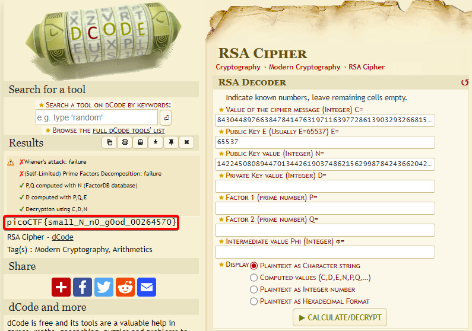

# Mind your Ps and Qs

**Author:** [yairp03](https://github.com/yairp03)  
**Category:** Cryptography  
**Points:** 20

# Challenge

## Description

In RSA, a small e value can be problematic, but what about N? Can you decrypt this? [values](./values)

## Source

[values](./values) (ASCII text)

# Solution

The [values](./values) file contains the following:

```
Decrypt my super sick RSA:
c: 843044897663847841476319711639772861390329326681532977209935413827620909782846667
n: 1422450808944701344261903748621562998784243662042303391362692043823716783771691667
e: 65537
```

`c` is the encrypted message, `n` is the modulus, and `e` is the public exponent. The modulus is relatively small, so we can factor it using [factordb](http://factordb.com/). There are tools that can do it for us, let's review them.

## Solution 1:

Using [RsaCtfTool](https://github.com/RsaCtfTool/RsaCtfTool):

```bash
$ python ./RsaCtfTool.py -n 1422450808944701344261903748621562998784243662042303391362692043823716783771691667 -e 65537 --uncipher 843044897663847841476319711639772861390329326681532977209935413827620909782846667
...
Unciphered data :
...
utf-8 : picoCTF{sma11_N_n0_g0od_00264570}
...
```

## Solution 2:

Using [dcode.fr](https://www.dcode.fr/rsa-cipher):



**The Flag:** `picoCTF{sma11_N_n0_g0od_00264570}`
