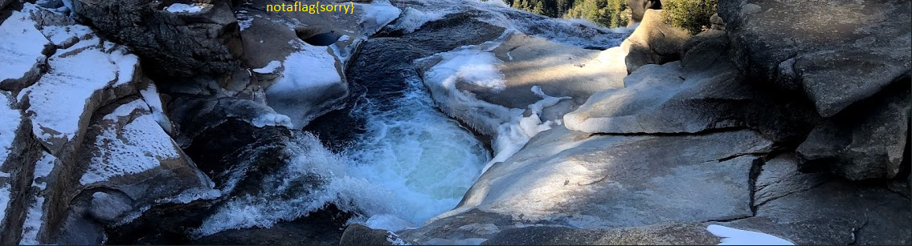

# tunn3l v1s10n

**Author:** [yairp03](https://github.com/yairp03)  
**Category:** Forensics  
**Points:** 40

# Challenge

## Description

We found this [file](./tunn3l_v1s10n). Recover the flag.

## Source

[tunn3l_v1s10n](./tunn3l_v1s10n) (Data file)

# Solution

Here we get a file with some binary data, and the description hints that we need to recover the flag from it. Let's open it in a [hex editor](/Guides/Tools/Hex%20Editors.md) and see what we can find:

We can see that the file starts with the bytes `42 4D` (BM), and with the help of [GCK's File Signatures Table](https://www.garykessler.net/library/file_sigs.html), we find out that it's the signature of a BMP file. We change the file extension to `.bmp`, but we still can't open it. Let's run the `BMP` template in [010 Editor](/Guides/Tools/Hex%20Editors.md#010-editor) and look at the fields:

We can see something weird here, the `bfOffBits` and the `biSize` fields, which are pointer to the start of the pixel data and the size of the info header, respectively, are both `53434`, which is much larger than it should be, as the expected values are `54` (The start of the pixel data) and `40` (The size of the info header). Let's change them to the expected values and see what happens:

We got a picture, but it doesn't has the flag. Let's continue looking at the image data:

The `biSizeImage` states the size of the pixel data, and it's value is `2893400`, but the size of the image data in the template is `0xFE4D8` which is the height of the image (`306`, blue) times the width of a line (`0xD4C`, green). This number is smaller, meaning the dimentions are probably incorrect as there is data that is unused. To calculate the actual height of the image, we can divide the size of the pixel data (`2893400`) by the width of a line (`0xD4C`) and get `850`. We can change the `biHeight` field to `850`, open the image and there we have it:

**The Flag:** `picoCTF{qu1t3_a_v13w_2020}`
