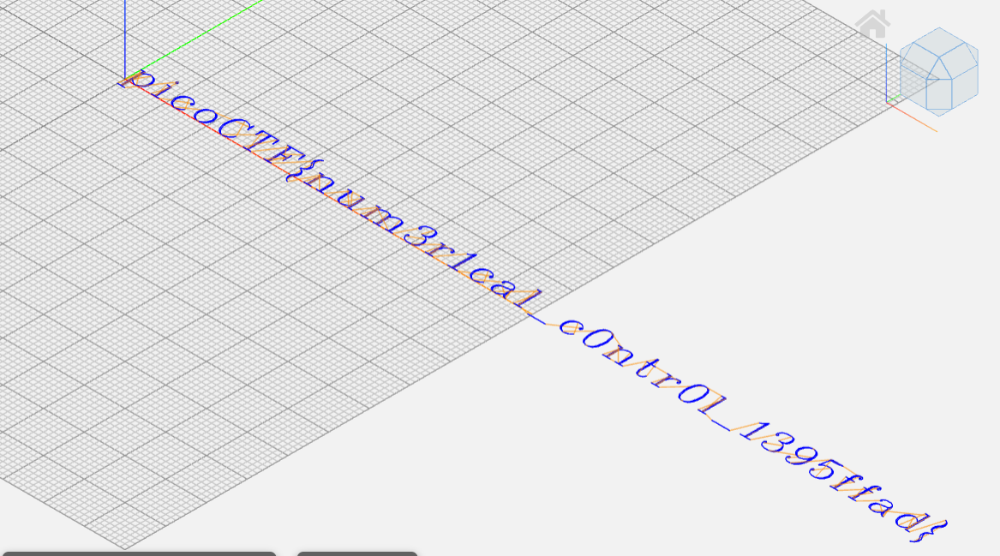

# speeds and feeds

**Author:** [yairp03](https://github.com/yairp03)  
**Category:** Reverse Engineering  
**Points:** 50

# Challenge

## Description

There is something on my shop network running at `nc mercury.picoctf.net 16524`, but I can't tell what it is. Can you?

# Solution

Connecting to the server, we get the following output:

```bash
$ nc mercury.picoctf.net 16524
G17 G21 G40 G90 G64 P0.003 F50
G0Z0.1
G0Z0.1
G0X0.8276Y3.8621
...
```

Searching up online, we find that this is a G-code commands, which is used to control CNC machines, like 3D printers. We can use an online G-code simulator, like [ncviewer](https://ncviewer.com/), to visualize the output.

We can save the output to a file so it's easier to work with:

```bash
$ nc mercury.picoctf.net 16524 > output.gcode
```

Loading the file into the simulator, we get the following image:



And there's our flag!

**The Flag:** `picoCTF{num3r1cal_c0ntr0l_1395ffad}`
