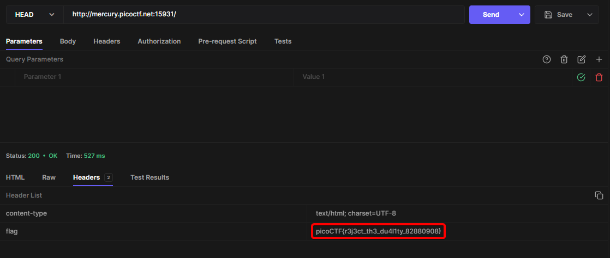

# GET aHEAD

**Author:** [yairp03](https://github.com/yairp03)  
**Category:** Web Exploitation  
**Points:** 20

# Challenge

## Description

Find the flag being held on this server to get ahead of the competition http://mercury.picoctf.net:15931/

# Solution

In this challenge, we are given a link to a website with two buttons that changes the background color when clicked. Looking at the page source we see the following:

```html
<form action="index.php" method="GET">
  <input type="submit" value="Choose Red" />
</form>

<form action="index.php" method="POST">
  <input type="submit" value="Choose Blue" />
</form>
```

So, the server decides which background color to set based on the `HTTP` method used.
The challenge name is a hint to use the `HEAD` method, which is another HTTP method similar to `GET` but only returns the headers of the response, not the body. There are multiple ways to send a `HEAD` request, let's review two of them:

## Solution 1:

Using [curl](https://curl.se/) command line tool:

```bash
$ curl --head http://mercury.picoctf.net:15931/
HTTP/1.1 200 OK
flag: picoCTF{r3j3ct_th3_du4l1ty_82880908}
Content-type: text/html; charset=UTF-8
```

## Solution 2:

Using an [API Client](/Guides/Tools/API%20Clients.md). Here, I used [Hoppscotch](/Guides/Tools/API%20Clients.md#hoppscotch):



**The Flag:** `picoCTF{r3j3ct_th3_du4l1ty_82880908}`
